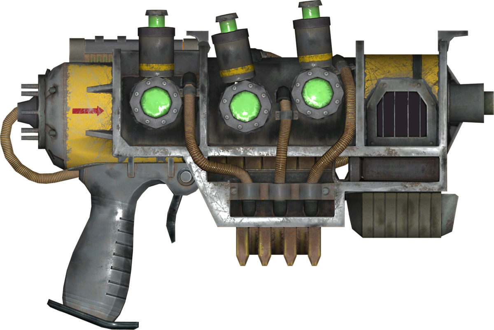

<h1> COIGAN - IROS 2024</h1>

 

Revisited COIGAN project for the IROS 2024 conference. This project exploit the COIGAN training architecture to generate a dataset of defected images from a dataset of the new Morandi bridge located at Genova.

# Table of Contents
- [Table of Contents](#table-of-contents)
- [Model results](#model-results)
  - [Dataset used for the training](#dataset-used-for-the-training)
  - [Sample results](#sample-results)
  - [Fid evaluation](#fid-evaluation)
- [Build the Docker image](#build-the-docker-image)
- [Run the Docker image](#run-the-docker-image)
- [Run the training](#run-the-training)
- [Run the evaluation](#run-the-evaluation)
- [Run the inference](#run-the-inference)

# Model results

## Dataset used for the training

## Sample results

## Fid evaluation

# Build the Docker image

# Run the Docker image

# Run the training

# Run the evaluation

# Run the inference

